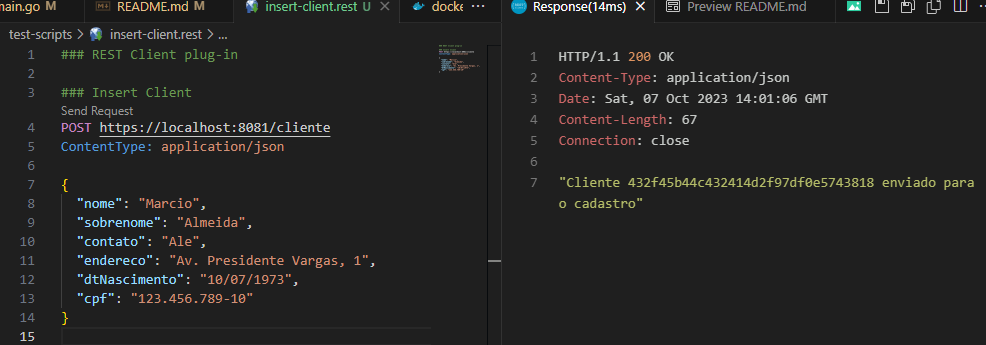
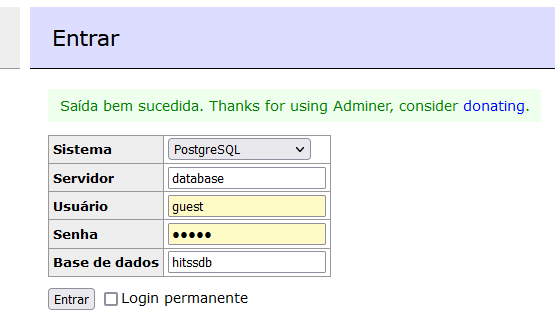
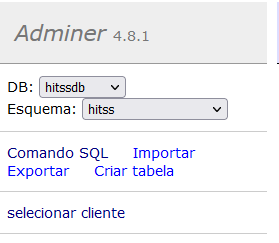

# HITSS

Para construir este projeto é necessário configurar algumas variáveis de ambiente conforme o descrito abaixo:
* USER - usuário tanto to RabbitMQ quando do Postgres, por padrão estou usando o que é configurado automaticamente no RabbitMQ
  * `guest`
* PWD - senha tanto to RabbitMQ quando do Postgres, por padrão estou usando o que é configurado automaticamente no RabbitMQ      
  * `guest`
* QUEUE_INSERT - nome da queue responsável por transmitir os dados que serã inserids noo banco de dados
* DBNAME - nome do banco de dadoos no Postgress

Uma vez que estas variáveis estejam definidas podemos executar os comandos abaixo para construir e executar os recursos necessários para o teste
```bash
$ docker compose build
$ docker compose up -d
```

Uma forma mais objetiva que uso para construir é o comando abaixo (somente funciona no linux)
```bash
$ USER=guest PWD=guest QUEUE_INSERT=insert QUEUE_DELETE=delete QUEUE_UPDATE=update DBNAME=hitssdb docker compose build
$ USER=guest PWD=guest QUEUE_INSERT=insert QUEUE_DELETE=delete QUEUE_UPDATE=update DBNAME=hitssdb docker compose up -d
```

## Endpoints

### POST - /cliente
Este endpoint recebe um objeto cliente conforme o exemplo abaixo e persiste no banco de dados
> O ID é formado gerando um hash a partir do CPF sem os caracteres especiais, desta forma garante um ID único e não expoem um dados sensível do cliente

> Segue alguns CPF's gerados para teste
> 259.224.648-76
> 292.285.882-09
> 385.825.141-07
> 838.519.863-69

```
{
  "nome": "Marcio",
  "sobrenome": "Almeida",
  "contato": "Ale",
  "endereco": "Av. Presidente Vargas, 1",
  "dtNascimento": "10/07/1973",
  "cpf": "123.456.789-10"
}
```

### GET - /cliente
Este endpoint lista todos os clientes da tabela omitindo o CPF
> Por motivo de segurança não achei interessante retornar o CPF de todos os clientes em uma consulta, mas isso depende da motivação, caso seja para um processo interno dentro da empresa, rodasse dentro da um rede interna e fosse necessário poderia ser retornado o CPF

### GET - /cliente/{id}
Este endpoint retorna um cliente específico, novamente sem o CPF

### GET - /cliente/cpf/{cpf}
Este endpoint peermite que o cliente recupere seu dados (incluindo seu ID) buscando pelo CPF
> Este endpoint foi adicionado para que o cliente possa recuperar seu ID a partir do próprio CPF

### DELETE - /cliente/{id}
Este endpoint remove um cliente específico da base de dados pelo ID do cliente

### UPDATE - /cliente/{id}
Este endpoint atualiza um cliente a partir do ID informado

## Scripts
A pasta scripts possuem scripts para a definição do banco de dados que será criádo no `Postgres` na criação do projeto

Basicamente será criado um schema `hitss` e a tabela `cliente` neste schema

## Fazendo requisições no projeto
Mesmo rodando localmente este projetoo foi criado para receber requisições HTTPS, desta forma eu recomendo utilizar o plug-in para o vscode chamado `REST Client`

Estou deixando um pasta chamada `test-scripts` com alguns exemplos de testes prontos para uso



## Acessando o BD
Eu configurei um client para que sejá possível acessar o postgres e verificar se os dados enviados fram cadastrados

Para se logar é necessário acessar a URL http://localhost:8083
As imagens abaixo exemplificam como logar



